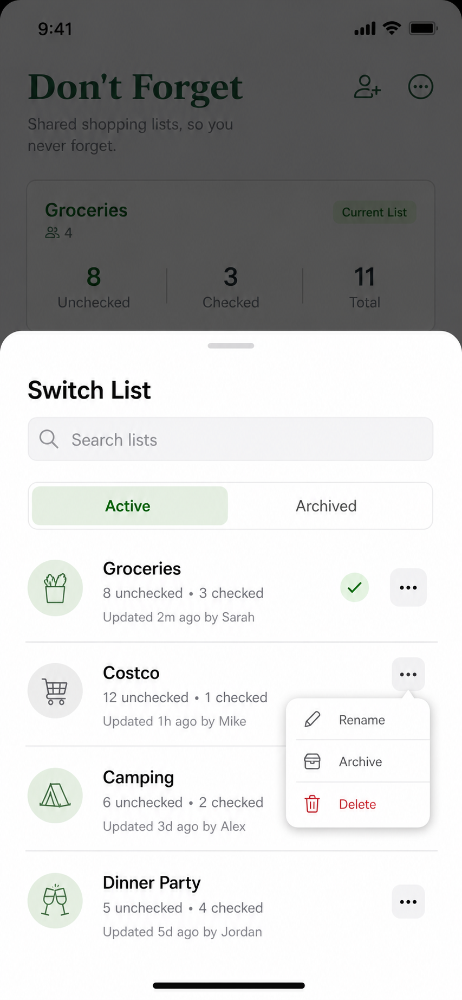

# List Creation And Switching Discussion Notes

Date: 2026-06-04

This note captures decisions made while stress-testing List creation and List switching. It exists so another agent or a restarted session can continue without re-litigating settled points or drifting away from the agreed direction.

## Context

Don't Forget currently has the domain language for many Lists per Household, but the app still renders a single default List.

Important current behavior and constraints:

- A **Household** owns zero or more **Lists**.
- **Current List** is the List a **Member** is viewing or editing within the Authenticated App Session. It is selection state, not a Household service or resource boundary.
- **Home** currently renders the active Household's selected Current List, but the implementation still hard-codes `DEFAULT_LIST_ID`.
- The Authenticated App Session does not load Current List, Lists, or Items. Route-owned code chooses a `listId` and calls session-scoped services after `session !== null`.
- `ListService` currently supports `getList({ listId })` only. List creation, List summary loading, renaming, deletion, and explicit Current List selection are not implemented.
- Lists currently have `deleted_at` tombstones but no archive state.
- `ActiveList` receives loaded state and explicit callbacks. It does not receive domain services directly.

Related docs and source reviewed during this discussion:

- `CONTEXT.md`
- `docs/adr/0012-authenticated-app-session-controller.md`
- `docs/how-things-work/authenticated-app-session.md`
- `docs/how-things-work/services.md`
- `docs/discussions/active-household-controller-grilling-2026-05-22.md`
- `docs/discussions/authenticated-app-session-simplification-grilling-2026-05-28.md`
- `lib/services/list/list-service.ts`
- `screens/home/home-current-list.tsx`
- `screens/home/use-home-current-list.ts`
- `db/schema/household.ts`
- `docs/how-things-work/app-structure.md`
- `docs/code-standards/styling.md`
- Current Expo UI docs via Context7 for `@expo/ui/swift-ui` `BottomSheet`, `Host`, and `RNHostView`

Related docs updated during this discussion:

- `docs/discussions/list-creation-switching-discussion-2026-06-04.md`

## Decisions Made

### 1. Keep Current List selection local-only

Current List selection should be local app state for the signed-in device/session. It should not be stored in the directory DB, the Household DB, or any server-owned state.

Rationale:

- Current List selection is a viewing/editing preference for one User's app experience, not shared Household domain data.
- Switching Lists should not affect other Members or other devices.
- Keeping it local preserves the existing boundary: the Authenticated App Session owns signed-in app resources, while route-owned UI chooses the explicit `listId` it loads.

Rejected alternatives:

- **Directory DB User preference**: rejected because it would make List switching follow the User across devices before that product behavior is needed.
- **Household DB setting**: rejected because Current List selection is not shared Household data and must not sync to other Members.

Implementation direction:

- Add an app-local Current List selection store owned near the signed-in UI/session boundary.
- The store returns the selected `listId` for route-owned List loading; services still receive explicit `listId` inputs.

### 2. Persist local Current List selection across app restarts

Local Current List selection should survive normal app process restarts on the same device, but remain local-only.

Rationale:

- If a User switches to a secondary List, reopening the app should keep that selection instead of snapping back to the default `Groceries` List.
- This preserves a good single-device experience without introducing cross-device preference sync.

Rejected alternatives:

- **Runtime-only memory**: rejected because it would reset selection on every app restart and make List switching feel incomplete.

Implementation direction:

- Store the selected `listId` in local app storage, not in the directory DB or Household DB.
- Clear the stored selection during signed-in local session cleanup/sign-out.
- If the stored List is missing or tombstoned, fall back to a deterministic non-deleted List.

### 3. Key local Current List selection by User and Household

Persisted local Current List selection should be keyed by app-owned `userId` plus `householdId`.

Rationale:

- A User who belongs to multiple Households should have an independent Current List selection for each Household.
- Different signed-in Users on the same device must not see each other's selection state.
- `userId + householdId` matches the product meaning better than a global device preference or a Member-only key.

Rejected alternatives:

- **Global device selection**: rejected because it would leak selection across Households and Users.
- **Member-only selection key**: rejected because it is less explicit about the Household boundary and can behave poorly if local state outlives Membership changes.

Implementation direction:

- Read and write selection through a key derived from `session.user.id` and `session.activeHousehold.id`.
- Validate the stored `listId` against non-deleted Lists before rendering it.

### 4. Fall back to the most recently active List

When the locally stored Current List selection is missing, invalid, or points to a tombstoned List, Home should fall back to the Household's most recently active non-deleted List.

Rationale:

- Recent activity better matches likely User intent than always opening the oldest List.
- If the User was recently working in a secondary List, losing local selection should still land them near their current work.
- First-run and empty-activity Households still behave deterministically because the initial `Groceries` List is created first.

Rejected alternatives:

- **Always select `DEFAULT_LIST_ID`**: rejected because it hard-codes an early-development default into future multi-List behavior.
- **Oldest non-deleted List as the primary fallback**: rejected because it ignores actual List activity.

Implementation direction:

- Add a List summary query that can compute a `lastActivityAt` value for each non-deleted List.
- Define List activity as the latest relevant timestamp from the List row, non-deleted Item rows, and Item check rows for Items in the List.
- Sort fallback candidates by `lastActivityAt DESC`, then stable tie-breakers such as `createdAt ASC, id ASC`.

### 5. Add `listLists()` as part of the List switching slice

The List service should grow a `listLists()` function for loading List summaries needed by switching and fallback selection. It should support querying/filtering rather than only returning a hard-coded unfiltered collection.

Rationale:

- List switching needs a first-class way to load candidate Lists; Home should not execute SQL or infer List collections indirectly from Items.
- Fallback selection and switcher UI both need List summary data, including recent activity.

Implementation direction:

- Keep the function on `ListService` so signed-in route-owned UI can call `session.services.lists.listLists(...)`.
- Return domain-shaped List summaries, not component props or raw SQL rows.
- Exclude tombstoned Lists by default.
- Include an `archived` property in the List summary contract.

### 6. Add List archiving as a first-class List lifecycle state

Lists should gain an archived state in the Household DB and service contracts. Archiving means the User is done with the List for normal use, but the List can be revived later.

Rationale:

- Archive and delete are meaningfully different product actions: archived Lists remain recoverable in normal app flows, while deleted Lists are tombstoned.
- The switcher/query contract needs to know whether a List is archived so normal List switching can hide or de-emphasize archived Lists.

Implementation direction:

- Add an archive column to the Household `lists` table through a migration.
- Expose archive state from `ListService` domain types and `listLists()`.
- Treat "delete a List" as setting `deleted_at`, consistent with the repo's soft-delete decision.

### 7. Store archive state as `archived_at`

The Household `lists` table should use nullable `archived_at` as the source of truth for archive state.

Rationale:

- `archived_at IS NULL` provides the active/archived check without a separate boolean.
- The timestamp is useful for future archive sorting and recovery flows.
- Unarchiving is a simple update back to `NULL`.
- This matches the existing tombstone style of `deleted_at`.

Rejected alternatives:

- **Boolean `archived` only**: rejected because it loses useful lifecycle timing.
- **Separate lifecycle status enum**: rejected as broader than this slice needs while `deleted_at` already represents deletion.

Implementation direction:

- Add `archived_at INTEGER NULL` to `lists`.
- Expose both `archived: boolean` and `archivedAt: number | null` in TypeScript List contracts.

### 8. Exclude archived Lists from normal switching and fallback

Archived Lists should be excluded by default from normal `listLists()` results, the normal List switcher, and Current List fallback.

Rationale:

- Archiving means the User is done with the List for normal use.
- A fallback that opens an archived List would contradict the meaning of archive.
- Archive recovery should be an explicit flow or explicit query, not mixed into the everyday switcher by accident.

Implementation direction:

- `listLists()` should default to active, non-deleted Lists.
- Support an explicit archive filter such as `"active" | "archived" | "all"`.
- Treat a locally selected archived List as invalid for Home and fall back to the most recently active non-archived List.

### 9. Allow Households to have zero active Lists

Users should be able to archive or delete every active List in a Household. The app should handle `listLists()` returning an empty active collection by showing an empty state with actions to create a new List.

Rationale:

- Archiving and deleting are explicit User choices; the app should not force a permanent active List if the User is done with all Lists.
- A zero-active-List state is simpler and more honest than auto-creating a replacement List after archive/delete.

Rejected alternatives:

- **Prevent archiving/deleting the last active List**: rejected because it blocks legitimate cleanup.
- **Automatically create a replacement List**: rejected because it could surprise the User and create unwanted Lists.

Implementation direction:

- Current List fallback returns an explicit "no active Lists" state when there are no active, non-deleted Lists.
- Home renders that state with UI actions to create a new List.
- `listLists()` returning `[]` for active Lists is valid and should not be treated as a load error.

### 10. Move to the most recently active remaining List after archiving/deleting the Current List

After the User archives or deletes the Current List, Home should immediately switch to the most recently active remaining non-archived List when one exists. If no active Lists remain, Home should show the zero-active-Lists empty state.

Rationale:

- Home should keep the User in a List when a valid active List remains.
- The same fallback ordering should handle startup, invalid local selection, and post-action selection.
- A neutral "no List selected" state is unnecessary while active Lists exist.

Implementation direction:

- Archive/delete actions should clear or replace the local Current List selection when they affect the selected List.
- Recompute the fallback using active, non-deleted Lists sorted by recent activity.

### 11. New Lists become the Current List immediately

When a User creates a List, the app should immediately set that List as the local Current List and render it.

Rationale:

- Creating a List is an intentional navigation action.
- Showing the new empty List confirms the action and lets the User start adding Items immediately.
- The same behavior works naturally from the zero-active-Lists empty state.

Implementation direction:

- `ListService.createList(...)` should resolve after the local Household DB insert.
- The route-owned UI should set local Current List selection to the created List ID after creation succeeds.
- Request sync with reason `localWrite` after the local List write succeeds.

### 12. Include create, rename, archive, unarchive, delete, and summary loading in this slice

The List switching implementation should include the service and UI behavior needed to create Lists, rename Lists, archive Lists, unarchive Lists, delete Lists, and load List summaries.

Rationale:

- Creation and switching need summary loading plus create.
- Archive/delete are part of the desired List lifecycle.
- Unarchive must exist so archive is recoverable rather than a one-way action.
- Rename should be available now so a User can correct or evolve List names without waiting for a later management slice.

Implementation direction:

- Add public ListService methods for the concrete product actions: `createList`, `renameList`, `archiveList`, `unarchiveList`, `deleteList`, and `listLists`.
- Consider sharing private implementation between rename/archive/unarchive/delete if it removes duplication without weakening the public contract.

### 13. Keep public List mutations concrete and use a private update helper

`ListService` should not expose a broad public `updateList()` method. It should expose concrete product actions and may use a private helper to keep row update mechanics maintainable.

Rationale:

- Public methods such as `renameList`, `archiveList`, `unarchiveList`, and `deleteList` encode product intent and leave room for action-specific validation, analytics, logging, and UI behavior.
- A public partial `updateList()` would make invalid action combinations too easy, such as renaming and deleting in one call.
- A private helper can still remove repetitive SQL and timestamp handling.

Rejected alternatives:

- **Public generic `updateList()`**: rejected because it weakens the service contract and blurs product actions.

Implementation direction:

- Keep public methods concrete: `createList`, `renameList`, `archiveList`, `unarchiveList`, `deleteList`, and `listLists`.
- Use a private helper shaped around updating an existing List row and returning the updated domain List if that keeps the implementation simpler.
- Public methods own validation and action-specific analytics/logging.

### 14. Include Item counts in `listLists()` summaries

`listLists()` should return active Item counts for each List so the switcher can show useful summary information.

Rationale:

- Counts make the List switcher more informative without requiring separate Item loads for every List.
- Counts are cheap to compute in the same query that calculates recent List activity.

Implementation direction:

- Add `uncheckedItemCount` and `checkedItemCount` to the List summary contract.
- Count only non-deleted Items.
- `checkedItemCount` means Items whose latest check-state row is checked.
- `uncheckedItemCount` means active Items minus checked Items.

### 15. Support archive, search, sort, and creator filters in `listLists()`

`listLists()` should support the filtering and sorting needed for the switcher and future archive views without becoming a generic query builder.

Rationale:

- Archive filtering separates normal List switching from archive recovery.
- Search by name helps once a Household has several Lists.
- Creator filtering supports views like "Lists I created" or filtering by another Household Member's User identity.
- Explicit sort modes keep the service contract predictable.

Implementation direction:

- Use an input shape like:

```ts
type ListListsInput = {
  archive?: "active" | "archived" | "all";
  searchText?: string;
  createdByUserId?: string;
  sort?: "recentActivity" | "name" | "createdAt";
};
```

- Default `archive` to `"active"`.
- Default `sort` to `"recentActivity"`.
- Always exclude tombstoned Lists.
- `searchText` filters List name case-insensitively.
- `createdByUserId` filters by the app-owned User ID stored in `lists.created_by_user_id`.
- `createdByUserId` accepts one User ID in this slice.
- Do not add pagination in this slice.

### 16. Use explicit recent-activity formula and deterministic sort tie-breakers

`lastActivityAt` should represent the latest meaningful List activity based on the List row, its non-deleted Items, and check-state changes for those non-deleted Items.

Rationale:

- Fallback selection and switcher ordering need deterministic behavior.
- Item check activity matters because checking/unchecking Items is one of the main ways a List changes.
- List metadata changes should count as activity because the List was recently touched.

Implementation direction:

- Compute `lastActivityAt` as the max of:
  - `lists.updated_at`
  - latest `items.updated_at` among non-deleted Items in the List
  - latest `item_checks.updated_at` for non-deleted Items in the List
- Sort `recentActivity` as `lastActivityAt DESC, createdAt ASC, id ASC`.
- Sort `name` case-insensitively as `name ASC, createdAt ASC, id ASC`.
- Sort `createdAt` as `createdAt DESC, id ASC`.
- Rename, archive, unarchive, and delete should update `lists.updated_at`.

### 17. Validate List names with trim, required, and max length rules

Create and rename should apply the same List name validation.

Rationale:

- Empty List names produce poor UI and unclear switching behavior.
- A length cap protects compact List switcher and header layouts.
- Duplicate names can be reasonable and avoiding uniqueness prevents offline/sync conflict complexity in this slice.

Implementation direction:

- Trim leading and trailing whitespace.
- Reject empty names after trimming.
- Limit names to 80 characters.
- Preserve internal whitespace.
- Allow duplicate List names within the same Household.

### 18. Track List mutation and explicit switching analytics without List names

Successful local List writes should emit typed analytics events, and explicit user-initiated List switching should be tracked so product usage can measure how often Users switch Lists.

Rationale:

- Existing Item mutations track after local write success; List mutations should follow that pattern.
- List names and search text are user content and should not be tracked.
- Automatic fallback selection would create noisy switching analytics, so switching analytics should focus on explicit user action.

Implementation direction:

- Track successful local List writes:
  - `list_created`
  - `list_renamed`
  - `list_archived`
  - `list_unarchived`
  - `list_deleted`
- Use common properties:
  - `household_id`
  - `list_id`
  - `user_id`
- Track explicit switcher selection with a separate event such as `current_list_selected` or `list_switched`.
- Do not track List names, search text, or Item counts.

### 19. Track explicit List switching only for selecting an existing List

Creating a List should emit `list_created` but should not also emit the List switching event. The switching event should represent explicit selection of an existing List from the switcher.

Rationale:

- Create-and-switch behavior is already measured by `list_created`.
- Keeping `list_switched` limited to explicit selection makes the metric cleaner and easier to interpret.

Implementation direction:

- Emit `list_switched` when the User selects an existing List in the switcher.
- Do not emit `list_switched` for automatic fallback or create-and-switch behavior.

### 20. Open List switching from the Home List header in an Expo UI bottom sheet

Tapping/clicking the Current List title/header on Home should open a bottom sheet containing List switching and List management information.

Rationale:

- Switching Lists is part of the primary Home workflow, not Household administration.
- The Current List title is the clearest affordance for changing the List being viewed.
- A bottom sheet keeps the User in context and fits iOS interaction expectations.

Rejected alternatives:

- **Household settings entry point only**: rejected because List switching is not administrative Household management.
- **Dedicated full route as the only switcher**: rejected for the first slice because a sheet is lighter and more directly tied to Home.
- **`@gorhom/bottom-sheet` as the default implementation**: rejected because the app's intended direction is Expo UI for iOS-native controls. The dependency exists today, but should not steer new UI unless Expo UI cannot support the interaction.

Implementation direction:

- Prefer Expo UI's `BottomSheet` from `@expo/ui/swift-ui`.
- Wrap SwiftUI subtrees in `Host` where required.
- Use `RNHostView` if the sheet needs to embed existing React Native List switcher content.
- Style SwiftUI internals with Expo UI modifiers and use Unistyles for React Native wrapper/layout tokens around the sheet.
- Make the Current List name/header pressable and inject an open-switcher action from the Home/container layer.
- Keep session/service access outside presentational `ActiveList` components.
- The bottom sheet should include active Lists, search, counts, create action, and per-List management actions.

### 21. Use an Expo UI sheet shell with app-styled React Native content

The List switcher should use Expo UI's native sheet presentation, but the switcher content should be styled as Don't Forget UI rather than relying on default iOS List styling.

Rationale:

- Expo UI `BottomSheet` supports native iOS sheet presentation while allowing React Native content through `RNHostView`.
- React Native content inside `RNHostView` can use Unistyles, app-owned tokens, custom rows, search, segmented controls, and action menus.
- Current Expo UI docs and installed types support sheet detents, drag-indicator visibility, fit-to-content sizing, background interaction, and hosted React Native content. They do not imply that the app must use default SwiftUI List visuals.

Implementation direction:

- Use `BottomSheet` from `@expo/ui/swift-ui`.
- Use `Group` with presentation modifiers such as `presentationDetents(...)` and `presentationDragIndicator(...)`.
- Use `RNHostView` for the app-styled List switcher body.
- Hide the system drag indicator if a custom app-styled handle is needed, then render that handle inside the React Native sheet content.
- Use Unistyles for the switcher content and wrapper layout.

Known constraint:

- In the installed `@expo/ui` version, the app can style the hosted React Native content background and SwiftUI content backgrounds, but there is no exposed iOS `presentationBackground(...)` modifier for recoloring every part of the native sheet container/chrome. This is acceptable for this use case as long as the app-styled content fills the visible sheet body.

### 22. Use Active and Archived segments inside the List switcher sheet

The List switcher bottom sheet should include an `Active` / `Archived` segmented control.

Rationale:

- Active Lists are the normal switch candidates.
- Archived Lists need an explicit recovery view without mixing them into normal Current List fallback or everyday switching.

Implementation direction:

- Default the sheet to the `Active` segment.
- `Active` shows active Lists and supports selecting a List, renaming, archiving, and deleting.
- `Archived` shows archived Lists and supports unarchiving and deleting.
- Selecting an archived List should not make it the Current List directly. The User must unarchive it first.
- After unarchiving a List from the archived segment, switch to it immediately.

### 23. Show a Home empty state when there are zero active Lists

When a Household has no active, non-deleted Lists, Home should render a valid empty state instead of treating the missing Current List as an error.

Rationale:

- Users are allowed to archive or delete every active List.
- The app should guide them toward creating a new List or recovering an archived List.

Implementation direction:

- Keep the signed-in member bar visible.
- Show a focused empty state with:
  - title `No active Lists`
  - body `Create a List to start adding Items.`
  - primary action `Create List`
  - secondary action `View Archived` only when archived Lists exist
- Do not mount `ActiveList.Provider`, the add-Item form, or Current List sync/error UI in this state.
- `Create List` opens the List creation flow.
- `View Archived` opens the List switcher sheet on the `Archived` segment.

### 24. Use a bottom sheet for List creation

Creating a List should use a bottom sheet with an input field for the List name.

Rationale:

- Creation is a lightweight focused task that should keep the User in Home context.
- The same create flow can be launched from the zero-active empty state and the List switcher sheet.

Implementation direction:

- Use the Expo UI sheet shell with app-styled React Native content, consistent with the switcher.
- The sheet should collect the List name and submit through `ListService.createList(...)`.
- After successful creation, close the sheet and make the new List the Current List.

### 25. Create List sheet fields and validation

The create List sheet should be a focused one-field flow.

Rationale:

- List creation needs only a name.
- Client-side validation avoids unnecessary local service errors while service-side validation remains authoritative.

Implementation direction:

- Field label: `List name`.
- Initial value: empty.
- Placeholder: `Groceries, Costco, Camping...`.
- Primary action: `Create`.
- Secondary action: `Cancel`.
- Disable `Create` until the trimmed name is non-empty and at most 80 characters.
- Pressing return submits when valid.
- On submit success, close the sheet, set the new List as Current List, and render the new empty List.
- On submit failure, keep the sheet open and show a short error.

### 26. Rename Lists with the same bottom-sheet form pattern

Renaming a List should use the same one-field bottom-sheet form pattern as List creation, with the current List name prefilled.

Rationale:

- Create and rename share the same name validation and focused editing interaction.
- Archived Lists can be renamed because they remain recoverable List records.

Implementation direction:

- Rename sheet field label: `List name`.
- Initial value: current List name.
- Primary action: `Save`.
- Secondary action: `Cancel`.
- Use the same trimmed, required, max-80 validation as create.
- Make rename available for both active and archived Lists.
- If the trimmed name is unchanged, close the sheet without calling the service.
- If renaming the Current List succeeds, update the visible Home header immediately.

### 27. Use lightweight confirmation for archiving a List

Archiving a List should show a lightweight confirmation before applying the action.

Rationale:

- Archive changes normal List visibility and Current List fallback behavior.
- Archive is reversible, so it does not need heavy destructive friction.

Implementation direction:

- Confirmation title: `Archive this List?`
- Body: `You can restore it later from Archived Lists.`
- Actions: `Archive` and `Cancel`.
- Do not require typing the List name.
- After archive succeeds, apply the agreed post-action selection rule.

### 28. Use stronger confirmation for deleting a List

Deleting a List should show stronger destructive confirmation before applying the tombstone.

Rationale:

- Delete removes the List from normal app surfaces and has no user-facing restore path in this slice.
- The app still uses soft-delete internally via `deleted_at`; the user-facing behavior is effectively irreversible for now.

Implementation direction:

- Confirmation title: `Delete this List?`
- Body: `This removes the List from the app. This cannot be undone.`
- Actions: destructive `Delete` and `Cancel`.
- Do not require typing the List name.
- After delete succeeds, apply the agreed post-action selection rule.

Clarification:

- Deleted Lists are not user-restorable in this slice. Restore/recovery belongs to archived Lists.

### 29. Unarchiving a List makes it the Current List

After a User unarchives a List from the Archived segment, the app should immediately make that List the local Current List.

Rationale:

- Unarchive is an intentional "bring this List back" action.
- Switching to the restored List confirms the action and lets the User resume using it immediately.

Implementation direction:

- `unarchiveList` clears `archived_at`, updates `updated_at`, and emits analytics after local write success.
- After unarchive succeeds, set local Current List selection to the unarchived List ID.
- Close the sheet or return Home in a way that clearly shows the restored Current List.

### 30. Keep List management local-first and offline-capable

List mutations and switching must preserve the app's offline-first behavior.

Rationale:

- Offline is a first-class requirement for List and Item workflows.
- List writes belong to the local Household DB first, with remote propagation handled by the sync coordinator.

Implementation direction:

- `createList`, `renameList`, `archiveList`, `unarchiveList`, and `deleteList` should resolve after local Household DB commit.
- Route-owned UI should request sync with reason `localWrite` after successful local List mutations.
- `listLists()` should read local Household DB data so switching works offline for locally available Lists.
- Current List switching should work offline for locally available active Lists.
- Local Current List selection persistence should work offline.
- Offline sync status should use the existing sync coordinator status pattern rather than treating local mutation success as failure.

### 31. Keep restore limited to archived Lists, not deleted Lists

Archived Lists should be restorable by Users. Deleted Lists should not have a user-facing restore path in this slice.

Rationale:

- Archive and delete need distinct meanings.
- If deleted Lists are restorable in normal UI, delete becomes too similar to archive.
- Recovering deleted Lists raises broader tombstone/retention and conflict questions that are out of scope for this slice.

Implementation direction:

- Archived Lists can be unarchived from the Archived segment and from any archived-current callout flow.
- Deleted Lists are excluded from `listLists()` and normal UI.
- If sync reveals that the Current List was deleted elsewhere, show a callout and offer switching away, not restore.

### 32. Show archived Current Lists read-only with restore or switch actions

If sync reveals that the local Current List was archived by another Member, the app should keep the List visible with a callout, but disable Item editing until the User restores or switches.

Rationale:

- Keeping the List visible helps the offline User understand what changed instead of abruptly moving them elsewhere.
- Disabling Item edits preserves the meaning of archive as "done for normal use."
- Restore remains an intentional User action.

Implementation direction:

- Callout title: `This List is archived.`
- Actions: `Restore` and `Switch List`.
- Disable add/check Item actions while the archived Current List is visible.
- `Restore` calls `unarchiveList`, keeps the List as Current, and re-enables editing after local write success.
- `Switch List` opens the switcher or moves to the fallback/empty state path.

### 33. Show a deleted-state message when the Current List is deleted elsewhere

If sync reveals that the local Current List was deleted by another Member, the app should replace the List body with a deleted-state message rather than keep showing stale Items.

Rationale:

- Deleted Lists have no user-facing restore path in this slice.
- Showing stale Items would imply the List remains inspectable or usable.
- A clear terminal state avoids confusing deleted with archived.

Implementation direction:

- Deleted-state title: `This List was deleted.`
- Body: `Switch to another List or create a new one.`
- Actions: `Switch List` and `Create List`.
- Do not offer restore for deleted Lists.

### 34. Distinguish user-initiated inactive actions from sync-discovered inactive Lists

The app should handle Current List archive/delete differently depending on whether the action was initiated by this User locally or discovered later through sync.

Rationale:

- If this User archives or deletes the Current List through the UI, immediately applying the post-action selection rule respects the intentional local action.
- If sync later reveals that another Member archived or deleted the Current List, auto-switching could unexpectedly move the User away from the List they were viewing or editing offline.
- This distinction keeps offline behavior understandable while preserving a smooth local management flow.

Implementation direction:

- User-initiated archive/delete of the Current List should immediately switch to the most recently active remaining active List, or show the zero-active empty state.
- Sync-discovered archive of the Current List should show the archived read-only callout with `Restore` and `Switch List`.
- Sync-discovered delete of the Current List should show the deleted-state message with `Switch List` and `Create List`.

### 35. Drive switcher filtering through `listLists()` with debounced search input

The List switcher should call `listLists()` when query inputs change, while debouncing free-text search input in the UI.

Rationale:

- `listLists()` is the service contract being added for archive filtering, creator filtering, search, and sorting, so the switcher should exercise that contract directly.
- Debouncing search text prevents unnecessary local queries and re-renders while the User is typing.
- Keeping filtering in the service avoids duplicating query semantics in UI state and reduces the chance that the switcher drifts from fallback or future List views.

Implementation direction:

- The sheet should keep immediate input state for the search field.
- Derive a debounced `searchText` value for the `listLists()` call.
- Non-text filters such as archive segment, creator filter, and sort can call `listLists()` immediately when changed.
- Use local Household DB reads; this remains offline-first.

### 36. Switch immediately when an active List is selected

When the User taps an active List in the switcher, the app should immediately set that List as the local Current List, close the sheet, and let Home load the selected List by ID.

Rationale:

- Switching Lists is a local selection change and should feel immediate.
- Waiting for a separate preflight load would complicate an offline-first interaction without much benefit.
- Home already has agreed behavior for archived or deleted Current Lists if a race or recent sync makes the selected List inactive.

Implementation direction:

- Persist the selected List ID as local Current List selection on tap.
- Emit `list_switched` for this explicit User selection.
- Close the switcher sheet immediately.
- Home loads the selected List and Items through the existing route-owned service flow.
- If the selected List is found to be archived or deleted, render the agreed archived callout or deleted-state message instead of silently changing selection again.

### 37. Use row overflow actions for List management in the switcher

Each List row in the switcher should reserve the main row tap for selection behavior and expose management actions through a trailing overflow button.

Reference mockup:



Rationale:

- Row tap should mean "switch to this List" for active Lists; mixing row tap with management actions would make selection less predictable.
- A trailing overflow affordance keeps rename/archive/delete discoverable without making every row visually heavy.
- Destructive delete can be visually separated inside the menu while archive remains a reversible lifecycle action.

Implementation direction:

- Active rows should support row tap to switch Lists.
- Active row overflow actions: `Rename`, `Archive`, `Delete`.
- Archived rows should not switch on row tap.
- Archived row overflow actions: `Rename`, `Unarchive`, `Delete`.
- Use an Expo UI/native menu where practical; keep the row body app-styled inside the Expo UI sheet.
- Keep `Delete` visually destructive.

### 38. Use distinct empty and error states inside the List switcher

The List switcher sheet should distinguish between truly empty List collections, filtered no-match states, and load errors.

Rationale:

- "No Lists exist" and "no Lists match this query" require different User actions.
- Archive and creator filters make filtered no-match states likely.
- Keeping errors inline preserves the sheet context and lets the User retry without losing their place.

Implementation direction:

- Active segment with no search/filter and no active Lists: show `No active Lists` with `Create List`, plus `View Archived` if archived Lists exist.
- Active segment with search/filter and no matches: show `No matching Lists`.
- Archived segment with no archived Lists: show `No archived Lists`.
- Archived segment with search/filter and no matches: show `No matching archived Lists`.
- Load error: show a compact inline error with `Try Again`; keep the sheet open.

### 39. Support creator filtering in the service before exposing creator filter UI

`listLists()` should support `createdByUserId` in this slice, but the first List switcher UI does not need a visible creator filter control.

Rationale:

- The service contract should be complete enough to support creator-based queries and tests now.
- The switcher already includes archive segments, search, row actions, creation, rename, archive, unarchive, and delete.
- Adding creator filtering UI before there is a reusable compact Member picker pattern could crowd the sheet and increase first-slice UI complexity.

Implementation direction:

- Implement and test `createdByUserId` on `listLists()`.
- Do not add a creator filter control to the first switcher UI unless an existing app pattern makes it straightforward.
- Future UI can add creator filtering without changing the service contract.

### 40. Return a distinct `ListSummary` contract from `listLists()`

`listLists()` should return a summary-specific type instead of returning the full `List` contract with optional summary fields mixed in.

Rationale:

- The switcher needs count and activity data that is summary-specific.
- Keeping `List` and `ListSummary` distinct avoids making every List object appear to have query-derived counts.
- A dedicated summary type makes tests and UI contracts clearer.

Implementation direction:

- Keep `getList()` returning the full `List` contract.
- Add a `ListSummary` type for `listLists()`.
- Include base fields needed by switcher UI:
  - `id`
  - `householdId`
  - `name`
  - `createdByUserId`
  - `createdAt`
  - `updatedAt`
  - `archived`
  - `archivedAt`
- Include summary fields:
  - `lastActivityAt`
  - `uncheckedItemCount`
  - `checkedItemCount`

### 41. Make `getList()` return lifecycle-aware results instead of throwing for deleted Lists

`getList({ listId })` should return a discriminated result for normal List lifecycle and selection states, rather than throwing when the requested List is deleted or missing.

Rationale:

- Deleted Lists can be discovered through normal sync and selection flows; this should not require try/catch for expected app behavior.
- Home needs to distinguish a deleted Current List from a missing or invalid selection.
- Archived Lists remain inspectable/restorable, so they should return as available Lists with archive fields.
- Throws should be reserved for infrastructure failures, malformed data, or unexpected programming errors.

Implementation direction:

- Change `getList()` from returning `Promise<List>` to returning a result shaped like:

```ts
type GetListResult =
  | { status: "available"; list: List }
  | { status: "deleted"; listId: string; deletedAt: number; updatedAt: number }
  | { status: "missing"; listId: string };
```

- Include `archived: boolean` and `archivedAt: number | null` on the `List` contract.
- Return `{ status: "available", list }` for active and archived Lists.
- Return `{ status: "deleted", listId, deletedAt, updatedAt }` when the row exists with `deleted_at`.
- Return `{ status: "missing", listId }` when no row exists locally.
- Do not throw `ListNotFoundError` for deleted or missing Lists after this contract change.

### 42. Exclude deleted Lists from every `listLists()` mode

`listLists()` should never return tombstoned/deleted Lists, including when `archive: "all"` is requested.

Rationale:

- The `archive` filter is about active versus archived lifecycle states, not tombstone visibility.
- Deleted Lists have no user-facing restore path in this slice.
- Keeping deleted Lists out of List management UI preserves a clear product distinction between archive and delete.

Implementation direction:

- Always apply `deleted_at IS NULL` inside `listLists()`.
- Interpret `archive: "all"` as active plus archived non-deleted Lists.
- Surface deleted Current Lists only through the lifecycle-aware `getList()` result so Home can render the deleted-state message.

### 43. Keep Current List unchanged when managing a non-current List

Archiving or deleting a non-current List should not change the local Current List selection.

Rationale:

- Managing another List from the switcher should not unexpectedly move the User away from the List they are currently viewing.
- The post-action fallback rule exists to recover from the Current List becoming inactive, not as a general side effect of every management action.

Implementation direction:

- If the archived/deleted List is the Current List, apply the agreed post-action selection rule.
- If the archived/deleted List is not the Current List, keep the current selection unchanged.
- Refresh the switcher rows after the mutation so the managed List moves segments or disappears as appropriate.

### 44. Allow duplicate List names without warnings or synthetic suffixes

The service and UI should allow duplicate List names without treating them as application errors.

Rationale:

- Duplicate names are user-controlled content and are more of a User mistake than a system integrity problem in this slice.
- Preventing duplicates would introduce offline/sync conflict complexity.
- Adding synthetic labels such as `Costco (2)` would display names the User did not choose.

Implementation direction:

- Keep duplicate names valid for create and rename.
- Do not show a duplicate-name warning in the first slice.
- Do not append generated suffixes in the switcher UI.
- Let row context such as Item counts and last activity help distinguish duplicates.

### 45. Persist trimmed List names

Create and rename should save the trimmed List name rather than preserving leading or trailing whitespace.

Rationale:

- Validation already uses the trimmed value for required and max-length checks.
- Saving the trimmed value keeps List display predictable.
- Leading and trailing whitespace can create confusing near-duplicate names that are hard to see in compact UI.

Implementation direction:

- Trim leading and trailing whitespace before create and rename writes.
- Preserve internal whitespace exactly as typed.
- Use the persisted trimmed value for unchanged-name checks during rename.

### 46. Discard unsaved create/rename drafts on sheet dismissal

If the User cancels or dismisses the create/rename sheet with unsaved text, the app should discard the draft without confirmation.

Rationale:

- Create and rename are one-field lightweight forms.
- Confirming dismissal would add friction out of proportion to the cost of retyping a short List name.
- Keeping dismissal simple matches the sheet-based interaction.

Implementation direction:

- Tapping `Cancel` discards the local draft and closes the sheet.
- Dragging/dismissing the sheet also discards the local draft.
- Do not show an unsaved-changes confirmation in this slice.

### 47. Allow local List mutations while sync is offline or failing

Create, rename, archive, unarchive, and delete should submit as long as the local Household DB write can succeed, even if remote sync is offline or currently failing.

Rationale:

- Offline is a first-class requirement.
- List management actions are local-first writes, with remote propagation handled separately by sync.
- Blocking forms on remote sync state would make offline List management feel broken even when the local app can safely record the intent.

Implementation direction:

- Do not disable List mutation actions because sync is offline or failing.
- Treat the local Household DB commit as the service success point.
- Request sync after successful local writes using the existing `localWrite` pattern.
- Surface sync status through the existing app sync UI/patterns rather than as a mutation failure.

### 48. Keep first-slice List management inside Home sheets

This slice should not add a dedicated List settings route.

Rationale:

- The agreed List management actions are lightweight and directly tied to Home usage.
- A separate settings route would add navigation surface before List metadata is rich enough to justify it.
- Bottom sheets keep create, switch, rename, archive, unarchive, and delete close to the Current List workflow.

Implementation direction:

- Launch the switcher from the Home List header.
- Launch create and rename flows as bottom sheets.
- Keep archive/delete confirmations in the same Home/sheet management flow.
- Revisit a dedicated List settings route only if future List metadata or permissions make the sheet too dense.

### 49. Focus tests on service behavior and Home state transitions

Tests for this slice should prioritize domain/service correctness and route-owned Home behavior rather than pixel-perfect sheet UI.

Rationale:

- `ListService` owns the most important new contracts and lifecycle rules.
- Local Current List selection is easy to regress because it combines persistence, Household scoping, and fallback behavior.
- Home state transitions prove that archived, deleted, and zero-active List cases behave gracefully.
- Sheet styling details are better verified through focused component/manual QA unless the existing test setup makes interaction tests cheap.

Implementation direction:

- Add `ListService` tests for create, rename, archive, unarchive, delete, lifecycle-aware `getList()` results, and `listLists()` filters/sorts/counts.
- Add local Current List selection tests for `userId + householdId` keying, persistence, invalid selection fallback, and zero-active behavior.
- Add Home/container tests for active List render, zero-active empty state, archived Current List read-only state, and deleted Current List state.
- Add a small switcher interaction test only if the existing UI test setup supports it without heavy new scaffolding.

### 50. Limit migration/backfill work to the archive column

The List archive migration should add the archive column and let existing Lists remain active by default.

Rationale:

- Existing Lists should naturally be active because `archived_at` is nullable and defaults to `NULL`.
- Existing provisioning already creates the default List; this slice should verify that behavior but not add a second compatibility path.
- The project treats this as greenfield, so compatibility layers should not be added unless they are part of the product behavior.

Implementation direction:

- Add a migration that introduces nullable `archived_at` on `lists`.
- Do not backfill non-null archive values.
- Existing rows with `archived_at IS NULL` are active.
- Verify existing Household provisioning still creates the initial default List where expected.

### 51. Never fall back to archived Lists

The Current List fallback should not select archived Lists, even when a Household has zero active Lists.

Rationale:

- Archive means the List is done for normal use.
- Automatically opening an archived List would blur the distinction between active and archived lifecycle states.
- Zero-active is a valid state with explicit recovery actions.

Implementation direction:

- Fallback candidates are active, non-deleted Lists only.
- If there are no active Lists, render the zero-active Home empty state.
- Archived Lists can return to normal use only through explicit unarchive flows.

### 52. Update `updated_at` on every List row mutation and exclude deleted Lists from activity ranking

Every operation that mutates a List row should update `lists.updated_at`, including operations that set `archived_at` or `deleted_at`.

Rationale:

- Updating `updated_at` for every row mutation is common and keeps local row metadata coherent.
- Archive, unarchive, rename, and delete are meaningful List changes.
- Deleted Lists are not switcher or fallback candidates, so their updated timestamp should not affect `lastActivityAt` ranking for visible Lists.

Implementation direction:

- `createList`, `renameList`, `archiveList`, `unarchiveList`, and `deleteList` all write `updated_at`.
- `deleteList` sets both `deleted_at` and `updated_at`.
- `listLists()` always filters `deleted_at IS NULL` before calculating or sorting by `lastActivityAt`.
- `lastActivityAt` is only used for non-deleted List summaries and fallback candidates.

### 53. Make lifecycle mutations idempotent

Archive, unarchive, and delete should be idempotent for existing Lists.

Rationale:

- Offline-first writes can be retried.
- Double taps or repeated submissions should not create unnecessary `updated_at` churn.
- Lifecycle actions are easier to reason about when applying the same target state twice is harmless.

Implementation direction:

- `archiveList` on an already archived List should return the archived List without updating timestamps again.
- `unarchiveList` on an active List should return the active List without updating timestamps again.
- `deleteList` on an already deleted List should return a deleted result without updating timestamps again.
- Missing List IDs should return a typed missing result or action-specific failure according to the final method contract.

### 54. Make unchanged renames idempotent

Renaming a List to its existing trimmed name should be a no-op.

Rationale:

- The UI should avoid calling the service when the trimmed name is unchanged, but the service should still be safe for other callers.
- Avoiding an update prevents meaningless `updated_at` churn.
- Avoiding analytics for no-op renames keeps `list_renamed` meaningful.

Implementation direction:

- Compare the incoming trimmed name to the stored List name.
- If unchanged, return the existing List without updating `updated_at`.
- Do not emit `list_renamed` for unchanged-name no-ops.
- If changed, update `name` and `updated_at`, then emit `list_renamed` after local write success.

### 55. Treat deleted Lists as terminal for this slice

Lifecycle and update mutations should not revive or modify deleted Lists.

Rationale:

- Deleted Lists have no user-facing restore path in this slice.
- Allowing archive, unarchive, or rename to modify deleted rows would blur delete with archive.
- Idempotent delete remains useful for retries and repeated submissions.

Implementation direction:

- `renameList` on a deleted List should return a deleted result or action-specific no-op result without changing the row.
- `archiveList` on a deleted List should return a deleted result or action-specific no-op result without changing the row.
- `unarchiveList` on a deleted List should return a deleted result or action-specific no-op result without changing the row.
- `deleteList` on an already deleted List should return the deleted result without changing timestamps again.

### 56. Return lifecycle-aware results from existing-List mutations

Mutations that target an existing List should return lifecycle-aware results instead of throwing for deleted or missing Lists.

Rationale:

- Existing-List mutations can race with sync-discovered delete or local selection staleness.
- Callers need to handle deleted and missing target Lists as normal lifecycle/selection states.
- Keeping result shapes consistent with `getList()` avoids try/catch for expected product behavior.

Implementation direction:

- `createList` returns the newly created available `List`.
- `renameList`, `archiveList`, `unarchiveList`, and `deleteList` return lifecycle-aware results.
- Existing-List mutation results should include at least `available`, `deleted`, and `missing` statuses.
- Validation or infrastructure failures can still use errors according to existing service conventions.

### 57. Return typed validation results for List name validation

Create and rename should return typed validation results for user-correctable List name errors instead of throwing.

Rationale:

- Empty and too-long List names are normal UI validation states.
- Returning typed results keeps create/rename sheets simple and avoids try/catch for expected User input mistakes.
- Infrastructure failures and malformed data can still throw.

Implementation direction:

- Use a validation reason shape such as:

```ts
type ListNameValidationError = "required" | "tooLong";
```

- `createList` can return `{ status: "invalidName"; reason: ListNameValidationError }` for invalid names.
- `renameList` can return `{ status: "invalidName"; reason: ListNameValidationError }` for invalid names, alongside lifecycle statuses for the target List.
- The UI should still disable obvious invalid submissions before calling the service, but the service remains authoritative.

### 58. Capture the current User in `ListService` dependencies

`ListService` should receive the current authenticated `userId` when the session creates the service, rather than requiring public write methods to accept `userId`.

Rationale:

- List writes and analytics should use the authenticated User identity from the session boundary.
- Route-owned UI should not have to pass creator/actor identity through every List method call.
- Avoiding per-call `userId` inputs reduces the chance that random call sites spoof creator or analytics identity.

Implementation direction:

- Add `userId` to `ListServiceDeps`.
- `createList` should use the captured `userId` for `created_by_user_id`.
- List mutation analytics should use the captured `userId`.
- Keep `listLists({ createdByUserId })` as an explicit query filter because that is filtering data, not declaring the actor.

### 59. Do not show creator identity in first-slice switcher rows

The List switcher should include `createdByUserId` in `ListSummary`, but does not need to display creator identity in row UI for this slice.

Rationale:

- Showing creator identity requires mapping User IDs to Member display names.
- The first switcher row already has enough useful context with List name, current indicator, Item counts, and recent activity.
- Keeping creator data in the contract preserves future filtering/display options without adding UI complexity now.

Implementation direction:

- Keep `createdByUserId` in `ListSummary`.
- Do not render creator text in the first List switcher row design.
- Revisit creator display when the app has a reusable Member identity display pattern.

### 60. Display recent activity with simple human-friendly date text

List switcher rows should display recent activity from `lastActivityAt` using compact human-friendly text.

Rationale:

- Recent activity helps distinguish Lists without requiring exact timestamps.
- Compact relative text fits the switcher row better than full date/time strings.
- The row only needs enough context to help the User choose a List.

Implementation direction:

- Show values such as `Updated today`, `Updated yesterday`, or `Updated Jun 2`.
- Do not show exact timestamps in this slice.
- Centralize formatting in an app-owned date/time utility so future screens can reuse the same human-friendly time behavior.

### 61. Standardize human-friendly time formatting on `date-fns` behind `lib/time`

The app should add `date-fns` as the go-to library for human-friendly date/time display transformations and expose app-owned utility functions from `lib/time`.

Rationale:

- `date-fns` is modular, function-based, and works with native `Date` values.
- It fits timestamp formatting needs such as `Updated today`, `Updated yesterday`, and `Updated Jun 2` without global plugin setup.
- Wrapping library calls in `lib/time` keeps UI components consistent and makes formatting rules easy to test.

Rejected alternatives:

- **Day.js**: viable, but relative/today behavior depends on global plugin extension.
- **Luxon**: powerful for richer date-time and time-zone modeling, but heavier than this display need.
- **Ad hoc `Date` formatting in components**: rejected because it would duplicate formatting rules across UI.

Implementation direction:

- Add `date-fns` as a dependency during implementation.
- Create utility functions under `lib/time` for display transformations.
- Add a helper for List activity text, shaped around inputs like `lastActivityAt` and injectable/current `now`.
- UI components should call app-owned time utilities instead of importing `date-fns` directly.
- Unit-test the utility behavior for today, yesterday, older dates, and year boundaries as needed.

### 62. Keep `lib/time` display helpers reusable and prefix-free

Time display utilities should return reusable date labels rather than List-specific phrases.

Rationale:

- `lib/time` should be useful across the app, not only for List switcher rows.
- Prefixes such as `Updated` are UI/domain copy, not generic date formatting.
- Keeping formatting and row copy separate makes both easier to test and adjust.

Implementation direction:

- Add a helper shaped like `formatRelativeDateLabel(timestamp, now)`.
- Return labels such as `today`, `yesterday`, `Jun 2`, or `Jun 2, 2025`.
- Compose List-specific row text in the switcher, such as `Updated ${label}`.

### 63. Include the year only for dates outside the current year

Relative date labels should stay compact for current-year dates and include the year for older dates.

Rationale:

- Current-year activity is easier to scan without a year suffix.
- Prior-year dates need the year to avoid ambiguity.
- The rule matches the compact switcher row layout.

Implementation direction:

- Return `today` for timestamps on the same local calendar day as `now`.
- Return `yesterday` for timestamps on the prior local calendar day.
- Return a label like `Jun 2` for older dates in the same year as `now`.
- Return a label like `Jun 2, 2025` for dates outside the current year.

### 64. Store timestamps as epoch milliseconds and display them in the viewer's local calendar

List and Item timestamps are stored as Unix epoch milliseconds, which represent absolute UTC-based instants. Human-friendly display labels should interpret those instants in the viewing device's local calendar.

Rationale:

- Existing schema defaults use SQLite `unixepoch() * 1000`, and services generate timestamps with `Date.now()`.
- Epoch milliseconds give the app a shared fixed reference point across Users and devices.
- Labels such as `today` and `yesterday` are display conveniences and should reflect the User's local viewing context.
- These labels are not audit timestamps and should not be used for conflict resolution.

Implementation direction:

- Continue storing List/Item timestamps as epoch milliseconds.
- `lib/time` helpers should accept epoch-millisecond timestamps.
- Determine `today`, `yesterday`, and formatted dates using the viewer's local calendar.
- Keep exact timestamp/debug/audit needs separate from compact switcher row labels.

### 65. Document epoch-millisecond assumptions near `lib/time`

The epoch-millisecond timestamp assumption should be documented near the reusable time display utilities and tests.

Rationale:

- The schema and service code already imply epoch milliseconds, but display helpers are where timezone and local-calendar behavior becomes visible.
- A centralized note prevents scattering timestamp comments across unrelated services.
- Tests can encode the behavior more clearly than broad prose comments.

Implementation direction:

- Add a concise module comment or test description in `lib/time` explaining that inputs are epoch milliseconds.
- Test that labels are based on the viewer's local calendar relative to `now`.
- Avoid adding repetitive timestamp comments throughout service methods unless a specific timestamp operation is non-obvious.

### 66. Keep time display helpers in `lib/time/display.ts`

The `lib/time` module should focus on display transformations, with UI-facing helpers placed in a dedicated `lib/time/display.ts` file.

Rationale:

- A `display.ts` filename makes the intent of these helpers explicit.
- Time display formatting is separate from timestamp generation.
- Repo standards already say services own timestamp generation with `Date.now()`.

Implementation direction:

- Add display helpers such as `formatRelativeDateLabel` in `lib/time/display.ts`.
- Export them through `lib/time` only if that matches the repo's local module pattern.
- Do not create a generic clock abstraction in this slice.
- Continue generating service timestamps inside services with `Date.now()`.

### 67. Accept only epoch milliseconds in time display helpers

`lib/time/display.ts` helpers should accept epoch-millisecond timestamps rather than broad `Date | number | string` inputs.

Rationale:

- Service contracts already expose app timestamps as epoch milliseconds.
- A narrow input contract avoids ambiguity between milliseconds, seconds, `Date`, and ISO strings.
- The helper can internally create `Date` objects for `date-fns`.

Implementation direction:

- Shape helpers like `formatRelativeDateLabel(timestampMs: number, nowMs: number = Date.now())`.
- Do not accept ISO strings or seconds.
- Tests should cover expected behavior with numeric epoch-millisecond inputs.

### 68. Throw on invalid time display helper inputs

Invalid timestamp inputs to `lib/time/display.ts` should be treated as programmer or malformed-data errors, not normal UI fallback states.

Rationale:

- Service schemas already validate and coerce SQL timestamp columns before UI receives them.
- Returning fallback labels such as `Unknown` would hide malformed data.
- A narrow helper contract is easier to test and reason about.

Implementation direction:

- Validate that timestamp inputs are finite epoch-millisecond numbers.
- Throw for invalid inputs.
- Do not add a user-facing fallback label for malformed timestamps in this slice.

### 69. Do not add special live refresh timers for time labels

The switcher should not add midnight timers or live refresh mechanics solely to update labels like `today` or `yesterday` while the sheet remains open.

Rationale:

- A sheet staying open across a local calendar boundary is an edge case.
- Normal interaction or data refresh will re-render labels when needed.
- A dedicated timer would add complexity out of proportion to the value in this slice.

Implementation direction:

- Compute display labels during render from the current timestamp value and the current `now` value used by the component.
- Let normal renders refresh labels.
- Do not add a midnight-specific timer or background interval for this behavior.

### 70. Show activity labels for empty Lists based on List row activity

Newly created or otherwise empty Lists should still show recent activity based on the List row's own timestamps.

Rationale:

- `lastActivityAt` already includes `lists.updated_at`.
- A newly created empty List was still recently created/touched.
- The switcher should not need Items to display an activity label.

Implementation direction:

- Continue computing `lastActivityAt` from List row activity even when there are no Items.
- A newly created empty List can display text such as `Updated today`.

### 71. Prefix switcher activity labels with `Updated`

Switcher rows should render the relative activity label as `Updated ${label}`.

Rationale:

- The prefix clarifies that the date reflects recent activity, not necessarily creation date.
- The row's secondary text can stay compact while avoiding ambiguous standalone dates.

Implementation direction:

- Use `formatRelativeDateLabel(...)` from `lib/time/display.ts` to get the reusable label.
- Compose row copy as `Updated ${label}` in the switcher UI.

### 72. Show the Current List in the switcher and prevent redundant reselects

The switcher should visibly mark the Current List and avoid treating taps on that row as a switch.

Rationale:

- Users need to know which List they are currently viewing.
- Re-selecting the Current List is a no-op and should not emit `list_switched`.
- Management actions should still be available for the Current List.

Implementation direction:

- Show a checkmark or equivalent selected-state indicator on the Current List row.
- Disable or no-op row selection for the Current List.
- Do not emit `list_switched` when the User taps the already-current List.
- Keep the row overflow menu available for `Rename`, `Archive`, and `Delete`.

### 73. Open the switcher on Archived when launched from an archived Current List callout

If sync reveals that the Current List is archived and Home shows the archived read-only callout, tapping `Switch List` should open the switcher on the `Archived` segment.

Rationale:

- In this specific path, the currently visible List is archived.
- Opening on `Archived` keeps the User oriented to the List they are being asked to resolve.
- This does not change the separate fallback rule for startup/invalid selection or user-initiated archive/delete actions.

Implementation direction:

- Normal Home header opens the switcher on `Active`.
- Zero-active `View Archived` opens the switcher on `Archived`.
- Archived Current List callout `Switch List` opens the switcher on `Archived`.
- The archived Current List row should show the selected/current indicator in the Archived segment.

### 74. Add Storybook coverage for List switching and lifecycle states

Implementation should include stories for the agreed List switcher, create/rename, confirmation, empty, archived, and deleted states.

Rationale:

- This feature has many stateful UI branches that are easy to regress.
- Stories make the intended behavior visible during implementation and review.
- Expo UI sheet behavior may still require simulator/manual QA, but stories can cover app-owned React Native content and state composition.

Implementation direction:

- Add stories for normal active switcher rows, current row indicator, row overflow actions, Active empty state, Archived empty state, filtered no-match states, and load error.
- Add stories for create and rename sheets, including invalid/disabled and service-error states.
- Add stories for archive and delete confirmations.
- Add stories for Home zero-active empty state.
- Add stories for archived Current List read-only callout and deleted Current List state.
- Add stories for duplicate List names and long List names to verify layout.

### 75. Keep the Home List header for archived Current Lists but not deleted Current Lists

Home should treat archived and deleted Current Lists differently at the header level.

Rationale:

- An archived Current List remains an inspectable List record and can be restored, so keeping the title/header visible preserves orientation.
- A deleted Current List is no longer inspectable or restorable in this slice, so showing a normal List header would imply the List can still be used.
- The deleted state should guide the User toward switching or creating without presenting deleted List chrome as active content.

Implementation direction:

- Archived Current List state keeps the Current List title/header visible and tappable.
- Tapping the archived Current List header opens the switcher on `Archived`.
- Deleted Current List state does not show the normal Current List title/header.
- Deleted Current List state shows the deleted message and explicit `Switch List` / `Create List` actions.

### 76. Show archived Current List Items read-only

When the Current List is archived, Home should keep existing Items visible but disable editing interactions.

Rationale:

- Archived Lists remain inspectable and restorable.
- Showing Items helps the User understand what they are restoring or switching away from.
- Read-only display preserves the meaning of archive as no longer active for normal editing.
- Deleted Lists remain different and should not show stale Items.

Implementation direction:

- Show the archived Current List's existing Items.
- Hide or disable add Item controls.
- Disable check/uncheck and other Item mutation interactions while archived.
- Keep `Restore` and `Switch List` actions visible through the archived callout.
- Deleted Current List state should not render stale Items.

### 77. Reuse normal Home Item visibility/filtering for archived read-only Lists

Archived Current Lists should use the same Item visibility and filtering behavior as active Lists, with editing disabled.

Rationale:

- Archive changes whether the List is active/editable; it should not introduce a separate Item filtering model.
- Reusing the normal Home visibility rules keeps the archived read-only state easier to reason about and test.

Implementation direction:

- Render the same Item set and ordering Home would normally render for the Current List.
- Disable or hide mutation controls in archived mode.
- Do not add archive-specific checked/unchecked filtering behavior in this slice.

### 78. Scope switcher search to the selected archive segment

Switcher search should search within the currently selected archive segment/filter rather than crossing active and archived Lists.

Rationale:

- Active and Archived are distinct browsing contexts.
- Archive recovery should remain explicit.
- Search results are easier to interpret when they do not silently mix lifecycle states.

Implementation direction:

- On the `Active` segment, search only active non-deleted Lists.
- On the `Archived` segment, search only archived non-deleted Lists.
- `listLists({ archive: "all", searchText })` remains available for future non-switcher use, but the first switcher UI should not use it for segment search.

### 79. Preserve search text across switcher segment changes

The List switcher should keep the current search text when the User switches between Active and Archived segments.

Rationale:

- A User searching for a specific List may reasonably want to check active and archived matches for the same text.
- Preserving the text avoids forcing retyping.
- The search field can provide a clear action to reset the query.

Implementation direction:

- Keep one search text state for the switcher sheet.
- Apply that search text to whichever archive segment is selected.
- Provide a standard clear-search affordance in the search field.

### 80. Keep Create List available from both switcher segments

The List switcher should expose Create List as a sheet-level action regardless of whether the User is viewing Active or Archived Lists.

Rationale:

- A User browsing Archived Lists may decide none of the old Lists should be restored and create a new one instead.
- Creation is a primary List management action and should not disappear based on the selected segment.
- New Lists are always active and become the Current List.

Implementation direction:

- Show Create List as a sheet-level action available from Active and Archived segments.
- Creating a List from the Archived segment still creates an active List.
- After successful create, close the create flow, set the new List as Current, and render it on Home.

### 81. Use one sheet shell with internal modes instead of stacked bottom sheets

The first implementation should not rely on stacked native bottom sheets. It should use one Expo UI sheet shell and switch the sheet content between modes such as switcher, create, and rename.

Rationale:

- Expo UI's iOS `BottomSheet` is backed by SwiftUI sheet presentation, and stacked native sheets would need simulator proof before becoming a product pattern.
- Stacked sheets can complicate keyboard focus, dismissal gestures, sheet height, and background ownership.
- A single sheet with internal modes still gives the User a layered flow while keeping state and dismissal behavior simpler.

Implementation direction:

- Use one List management sheet shell.
- Model content modes such as `switcher`, `create`, and `rename`.
- Transition from switcher row overflow `Rename` into the rename mode in the same sheet.
- Provide clear `Cancel`/back behavior from create/rename modes.
- Use confirmation dialogs or equivalent lightweight confirmations for archive/delete instead of opening another sheet layer.

### 82. Keep or close the management sheet based on whether Home context changes

List management actions should keep the sheet open when the User is still managing the same Home context, and close it when the Current List changes.

Rationale:

- Non-current List management is part of the switcher management workflow; closing the sheet would force the User to reopen it for related cleanup.
- Current List archive/delete changes what Home should display, so closing the sheet makes the result visible.
- Creating a List intentionally navigates the User into the new Current List.

Implementation direction:

- Rename non-current List: return to switcher mode, keep the sheet open, and refresh the row.
- Rename Current List: return to switcher mode, keep the sheet open, refresh the row, and update the Home header behind it.
- Archive/delete non-current List: keep the sheet open and refresh rows; archived rows move to Archived and deleted rows disappear from the current segment.
- Archive/delete Current List: apply the post-action selection rule and close the sheet.
- Create List: close the sheet, set the new List as Current, and render it on Home.

### 83. Make create/rename Cancel respect the launch origin

Cancel behavior in create and rename modes should depend on where the flow was launched from.

Rationale:

- A flow launched from the switcher should return the User to the switcher context.
- A flow launched directly from the Home zero-active empty state has no prior sheet context to return to.
- Rename is a management action reached from the switcher in this slice.

Implementation direction:

- Create launched from the switcher: `Cancel` returns to switcher mode.
- Create launched from Home zero-active empty state: `Cancel` dismisses the sheet.
- Rename launched from the switcher: `Cancel` returns to switcher mode.
- Dismissal gestures still discard drafts according to the earlier draft-dismissal decision.

### 84. Treat drag-to-dismiss from create/rename as closing the whole sheet

Dragging down to dismiss while in create or rename mode should close the full sheet and discard the draft.

Rationale:

- The explicit `Cancel` or back action handles returning to switcher context.
- A dismissal gesture usually means closing the modal flow, not stepping back one internal mode.
- This keeps gesture behavior simple and predictable.

Implementation direction:

- If the User drags the sheet down from create or rename mode, close the sheet.
- Discard unsaved draft text.
- Do not return to switcher mode from a drag-dismiss gesture.

### 85. Disable create/rename dismissal while submit is in progress

Create and rename modes should temporarily prevent dismissal and duplicate actions after the User submits and before the local service result returns.

Rationale:

- Local writes should be quick, but closing the sheet mid-submit can make the resulting state feel ambiguous.
- Preventing duplicate submissions avoids repeated writes or noisy service calls.
- This lock is only for the short local DB operation, not remote sync completion.

Implementation direction:

- Disable the primary action while submit is in progress.
- Disable or ignore Cancel/back while submit is in progress.
- Disable interactive sheet dismissal while submit is in progress if Expo UI support makes this practical.
- Re-enable controls if the service returns a validation or lifecycle result that keeps the sheet open.
- Do not wait for remote sync before unlocking or closing.

### 86. Disable archive/delete confirmation dismissal while mutation is in progress

Archive and delete confirmations should prevent duplicate destructive/lifecycle submissions while the local service call is in progress.

Rationale:

- Even idempotent mutations should avoid duplicate UI submissions and confusing busy states.
- Local writes should be short, so temporarily disabling controls is a low-friction safeguard.
- Current List archive/delete can change Home context, so the transition should happen after a clear local result.

Implementation direction:

- After the User confirms `Archive` or `Delete`, disable the confirm/destructive action until the local service result returns.
- Prevent repeated confirmation submissions while in progress.
- Keep the confirmation open in a busy state if the resulting UI should remain in the switcher flow.
- On successful Current List archive/delete, close the confirmation and management sheet as part of the post-action selection transition.
- Do not wait for remote sync before completing the local UI transition.

### 87. Treat missing mutation targets as stale local UI state

When a mutation targeting an existing List returns `missing`, the UI should treat the row or selection as stale local state rather than as a crash-worthy error.

Rationale:

- Missing target Lists can happen if local state is stale or a selection points at a row that no longer exists locally.
- The service contract intentionally returns lifecycle-aware results for these normal edge states.
- The UI should refresh local data and recover rather than require exception handling.

Implementation direction:

- For non-current List mutations returning `missing`, show a short inline or toast-style message such as `List is no longer available.`, refresh `listLists()`, and keep the sheet open.
- For Current List mutations returning `missing`, treat the local Current List selection as invalid and run the fallback path.
- Do not emit mutation analytics for `missing` no-op results.

### 88. Show generic user-facing errors and log technical details

Infrastructure or unexpected service failures in List management UI should show short generic messages to the User and log technical details through existing logger patterns.

Rationale:

- Users need clear recovery options, not SQL or infrastructure details.
- Technical details belong in logs where they can be diagnosed safely.
- Keeping the sheet open where possible preserves context and allows retry.

Implementation direction:

- Switcher load failure: `Lists could not be loaded.`
- Create failure after valid input: `List could not be created.`
- Rename failure after valid input: `List could not be renamed.`
- Archive failure: `List could not be archived.`
- Delete failure: `List could not be deleted.`
- Unarchive failure: `List could not be restored.`
- Provide `Try Again` for load failures and retryable inline states where practical.
- Do not show raw exception messages in UI.

### 89. Surface typed results at the smallest useful UI scope

Typed lifecycle and validation results should appear where the User can act on them most directly.

Rationale:

- Field validation belongs next to the field.
- Stale switcher rows should not take over the whole screen.
- Current List lifecycle changes affect the primary Home context and deserve full Home states.

Implementation direction:

- `invalidName`: show an inline field error in the create/rename sheet.
- `missing` for a non-current target: show a short toast/banner-style message such as `List is no longer available.`, refresh rows, and keep the sheet open.
- `deleted` for a non-current target during rename/archive/unarchive: show a short toast/banner-style message such as `List was deleted.`, refresh rows, and keep the sheet open.
- `deleted` for the Current List: render the Home deleted-state view.
- `archived` for the Current List: render the Home archived read-only callout.
- Infrastructure failures: show an inline message in the active sheet/state, with retry where useful.

### 90. Store app-local persisted values behind typed `lib/local-storage` wrappers

Current List selection should live in a new app-local storage area rather than inside `ListService`, with typed wrappers for each persisted value.

Rationale:

- Current List selection is local app preference state, not Household DB domain data.
- The app will likely need more non-secret one-value persisted preferences over time.
- A shared `lib/local-storage` area gives those values a consistent home without turning storage into an untyped JSON dumping ground.
- Each persisted value still needs a domain-specific wrapper, validation, key builder, and cleanup behavior.

Implementation direction:

- Add a `lib/local-storage/` package for non-secret app-local persisted values.
- Add a Current List selection wrapper there, such as `current-list-selection.ts`.
- The wrapper should key selection by `userId + householdId`.
- The stored value should be the selected `listId`.
- Invalid or corrupt payloads should be treated as no selection and removed.
- Keep `ListService` focused on Household DB List records and mutations.

### 91. Clear Current List selection for the signed-out User during session cleanup

Session cleanup should clear local Current List selection keys for the signed-in User who is signing out.

Rationale:

- Current List selection must not leak across signed-in Users on the same device.
- User-scoped cleanup is safer than broad deletion of every possible local-storage key on the device.
- The app can still add broader local-storage reset behavior later if a global reset path exists.

Implementation direction:

- Provide a local-storage helper that clears Current List selection entries for a given `userId`.
- Call that helper from signed-in session cleanup/sign-out paths.
- Do not require clearing selections for unrelated Users in this slice.

### 92. Store Current List selections as one map per User

Current List local storage should use one stored JSON map per `userId`, keyed by `householdId`.

Rationale:

- A per-User map makes signed-out cleanup a single key removal.
- It avoids relying on AsyncStorage key enumeration for normal cleanup.
- The wrapper can still expose a narrow selection API to callers.

Implementation direction:

- Store a value shaped like:

```ts
type CurrentListSelectionMap = Record<string, string>;
```

- The map key is `householdId`.
- The map value is the selected `listId`.
- Expose helper methods such as `getSelection(userId, householdId)`, `setSelection(userId, householdId, listId)`, `clearSelection(userId, householdId)`, and `clearUserSelections(userId)`.
- Validate persisted payloads before using them; invalid payloads should be removed and treated as no selection.

### 93. Keep storage validation separate from List existence validation

The Current List selection storage wrapper should validate persisted payload shape, but should not validate whether a stored `listId` exists in the Household DB.

Rationale:

- `lib/local-storage` should not need Household DB or `ListService` access.
- Storage validation and domain validation are separate concerns.
- Home/fallback logic already needs to understand active, archived, deleted, and missing List states.

Implementation direction:

- The storage wrapper validates that the persisted map is an object of string household IDs to string List IDs.
- Invalid/corrupt storage payloads are removed and treated as no selection.
- Home or a route-owned Current List resolver validates the stored `listId` against List service results.
- Invalid, archived-for-fallback, deleted, or missing stored selections flow through the agreed fallback/state rules.

### 94. Re-resolve Current List state after sync-driven reloads

Home should re-resolve the Current List against local Household DB state after sync or refresh may have changed Lists.

Rationale:

- Sync can reveal that the selected List was archived or deleted by another Member.
- Re-resolving against local DB state is how Home applies the agreed archived/deleted/missing behaviors.
- This keeps the local storage value as a preference while the rendered state reflects current List lifecycle data.

Implementation direction:

- After Home reloads due to sync/refresh, check the stored/current selected List through the List service.
- If the selected List is active, keep rendering it normally.
- If the selected List is archived due to sync, show the archived read-only state.
- If the selected List is deleted due to sync, show the deleted-state view.
- If the selected List is missing, run the fallback path to the most recently active List or zero-active empty state.

### 95. Reload List summaries after successful local List mutations

The switcher should reload summaries through `listLists()` after successful local List mutations instead of patching summary rows optimistically.

Rationale:

- `listLists()` owns count, activity, archive, search, and sort semantics.
- Reloading from local SQLite avoids duplicating summary derivation in UI state.
- Local reads should be fast enough for this management flow.

Implementation direction:

- After successful rename, archive, unarchive, or delete that keeps the sheet open, call `listLists()` again with the current query inputs.
- Keep the relevant in-progress UI state visible during the local mutation.
- Do not hand-compute updated `lastActivityAt` or Item counts in the switcher UI.

### 96. Request sync after successful local List mutations

Successful local List mutations should request sync immediately using the existing local-write sync pattern.

Rationale:

- The app is offline-first, but successful local writes should still attempt remote propagation promptly.
- This matches the general rule that most mutations should try to sync after a successful local write.
- UI completion should depend on the local write, not on remote sync success.

Implementation direction:

- After successful local `createList`, `renameList`, `archiveList`, `unarchiveList`, or `deleteList`, request sync with the existing `localWrite` reason/pattern.
- Do not block closing sheets, switching Lists, or refreshing local summaries on sync completion.
- Surface sync status through existing sync UI rather than mutation-specific failures when local write succeeds.

### 97. Do not request sync for Current List switching

Explicit Current List switching should not request remote sync.

Rationale:

- Current List selection is local-only User preference state.
- Switching does not mutate Household domain data.
- Sync should be reserved for local writes that need remote propagation.

Implementation direction:

- Persist explicit Current List selection to local storage.
- Emit `list_switched` for explicit selection of an existing active List.
- Do not call the sync coordinator for switching alone.

### 98. Defer haptics to a dedicated haptics effort

This List creation and switching slice should not add haptics.

Rationale:

- The app does not currently have a haptics helper or established feedback pattern.
- Adding haptics ad hoc inside this feature would create a new cross-cutting interaction style without enough design coverage.
- Haptics should be handled as a focused app-wide pass.

Implementation direction:

- Do not add haptic feedback for switching, create, archive, unarchive, delete, or rename in this slice.
- Revisit haptics in a dedicated effort that defines an app-owned helper or pattern.
- A future haptics idea is tracked in `docs/.local/ideas.md`.

### 99. Define accessibility semantics for header, rows, and actions

The Home Current List header, switcher rows, and row actions should expose clear accessibility labels and roles.

Rationale:

- The Current List title becomes an interactive control and must not read as plain text.
- Switcher rows combine several visual facts that should be available in one meaningful accessibility label.
- Management actions need labels that identify the target List.
- Delete is destructive and should be exposed as such where the platform API supports it.

Implementation direction:

- Home Current List header should be a button with a label such as `Current List, Groceries` and hint `Opens List switcher`.
- Active switcher rows should be buttons.
- Current active row label should include current state, counts, and activity, such as `Groceries, current List, 8 unchecked, 3 checked, updated today`.
- Non-current active row labels should include name, counts, and activity, such as `Costco, 12 unchecked, 0 checked, updated yesterday`.
- Archived rows should not expose row selection as a switch action.
- Row overflow buttons should have labels such as `List actions for Costco`.
- Delete actions should use destructive semantics where the platform API supports them.

### 100. Include the target List name in archive/delete confirmation bodies

Archive and delete confirmations should name the affected List in the body copy.

Rationale:

- Duplicate or similar List names are allowed.
- Naming the target reduces accidental archive/delete actions.
- Keeping the title generic and putting the name in the body keeps the confirmation scannable.

Implementation direction:

- Archive title: `Archive this List?`
- Archive body: `{ListName} will move to Archived Lists. You can restore it later.`
- Delete title: `Delete this List?`
- Delete body: `{ListName} will be removed from the app. This cannot be undone.`
- Keep action labels as `Archive` / `Cancel` and destructive `Delete` / `Cancel`.

### 101. Apply stable long-name layout rules

Long List names should be handled differently based on the surface.

Rationale:

- Dense navigation surfaces need stable dimensions.
- Confirmations can afford wrapping because they are focused.
- The create/rename form should behave like a normal one-line name input.

Implementation direction:

- Home header: single line, tail-truncated.
- Switcher row title: allow up to two lines, then tail-truncate.
- Confirmation body: allow wrapping so the target List name can be read.
- Create/rename input: single-line text input with normal horizontal editing behavior.

### 102. Split implementation into service/data and Home/UI slices

Implementation should be split into two reviewable slices rather than one large all-in-one diff.

Rationale:

- The service/data contract is substantial and should be proven before UI depends on it.
- UI integration has many state branches and Storybook coverage needs.
- Smaller slices reduce review risk and make regressions easier to isolate.

Implementation direction:

- Slice 1: service/data foundation.
  - Migration and schema for `archived_at`.
  - `ListService` contracts and mutations.
  - `listLists()` filters, sorting, counts, and `ListSummary`.
  - Lifecycle-aware `getList()` and existing-List mutation results.
  - `lib/local-storage` Current List selection wrapper.
  - `lib/time/display.ts` with `date-fns`.
  - List analytics events.
  - Unit/service tests.
- Slice 2: Home/UI integration.
  - Current List resolver.
  - Home active, zero-active, archived, deleted, and missing states.
  - Expo UI single-sheet List management flow.
  - Switcher rows, search, segments, create/rename modes, confirmations.
  - Storybook coverage.
  - Home/container and focused UI tests.

## Remaining Implementation Checks

The product and service semantics are settled enough to begin implementation. Remaining checks should happen during the build:

- Verify Expo UI `BottomSheet`, `ContextMenu` or menu-equivalent, and confirmation dialog behavior in the iOS simulator, especially with `RNHostView`, keyboard focus, and single-sheet internal modes.
- Decide exact component/file placement based on existing Home and component boundaries during implementation.
- Confirm the generated Household DB migration shape matches the repo's Drizzle migration conventions.
- Confirm Storybook can represent the app-owned sheet content and Home states without requiring native sheet presentation in every story.
